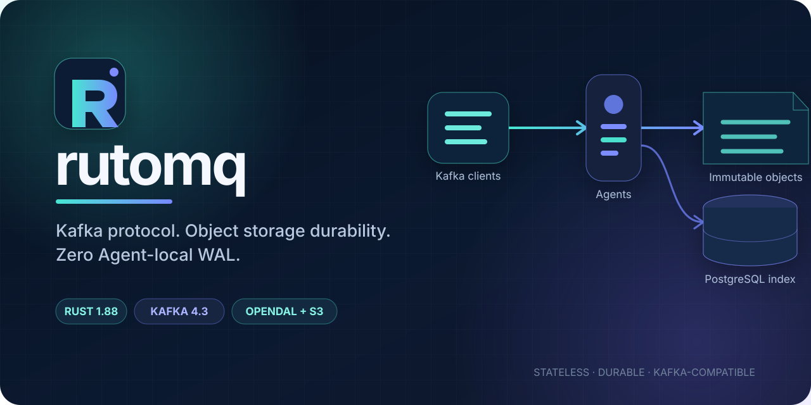
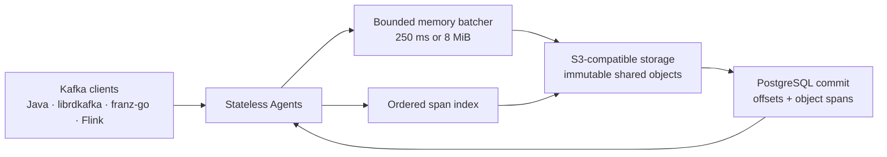

<p align="center">
  
</p>

<p align="center">
  <a href="https://github.com/SamuelSupe/rutomq/actions/workflows/ci.yml"></a>
  <a href="https://github.com/SamuelSupe/rutomq/releases/latest"></a>
  <a href="https://github.com/SamuelSupe/rutomq/blob/main/LICENSE"></a>
  
  
</p>

<p align="center">
  A stateless, Kafka-compatible message queue written in Rust.<br>
  Durable records live in S3-compatible object storage; ordered metadata lives
  in PostgreSQL. Agents keep no local WAL and require no persistent volume.
</p>

> [!IMPORTANT]
> `v0.1.0` is a public preview. It passed the documented Kafka client, Flink,
> Kafka Streams, multi-Agent, security, and Kubernetes acceptance envelope, but
> it does not claim complete semantic parity with every Apache Kafka deployment.
> See the [dated compatibility result](docs/compatibility-result-2026-07-30.md)
> and [API matrix](docs/compatibility.md) before production evaluation.

## Why rutomq

Traditional brokers couple durable data to broker-local disks and replica
placement. rutomq separates compute from durable state:

- **Stateless Agents** — any Agent can serve any topic, partition, or group.
- **No Agent-local WAL** — acknowledged data is never dependent on an Agent
  disk, PVC, or recovery journal.
- **Direct object-storage writes** — OpenDAL provides the S3/MinIO path,
  immutable objects, range reads, and multipart uploads.
- **Strong metadata ordering** — PostgreSQL allocates offsets, indexes object
  spans, and coordinates groups, producers, transactions, ACLs, and retention.
- **Honest Kafka negotiation** — `ApiVersions` advertises implemented versions;
  unknown versions receive protocol errors instead of synthetic success.

## Architecture



A Produce request is acknowledged only after the immutable object write
succeeds **and** the PostgreSQL metadata transaction commits. If object storage
succeeds but metadata commit fails, the object is invisible and later removed
by orphan GC. Fetch resolves ordered byte ranges from PostgreSQL, verifies their
checksums, and reads only the required object ranges.

[Read the architecture and consistency model →](docs/architecture.md)

## Compatibility snapshot

The `2026-07-30` release checkpoint validated:

| Area | Tested envelope |
| --- | --- |
| Kafka protocol | 74 API keys generated from Kafka 4.3 schemas; exact versions are listed in the matrix |
| Clients | Kafka Java 3.9.2 AdminClient, Kafka Java 4.2.0, librdkafka 2.15.0, franz-go 1.21.5 |
| Stream processing | Flink 2.2.1 + Kafka connector 5.0.0-2.2; Kafka Streams 4.2.0 |
| Delivery semantics | Idempotent Produce, transactions, `read_committed`, offset recovery, compression |
| Groups | Classic, Kafka 4 consumer, share, and Streams group protocols |
| Security | TLS, SCRAM-SHA-256/512, delegation tokens, ACLs, quotas |
| Durability | PostgreSQL + OpenDAL S3/MinIO, multi-Agent crash/retry and orphan-GC scenarios |
| Deployment | Docker Compose and Helm; Kubernetes rolling replacement and `3 → 5 → 2` scaling |

The full result explicitly documents unsupported and virtualized behavior:

- [Compatibility result](docs/compatibility-result-2026-07-30.md)
- [API-by-API compatibility matrix](docs/compatibility.md)
- [Detailed implementation reference](docs/implementation-reference.md)

## Quick start

Requirements: Docker with Compose. OrbStack is the primary tested local
environment.

```bash
git clone https://github.com/SamuelSupe/rutomq.git
cd rutomq
docker compose -f deploy/compose.dev.yml up --build -d
```

Wait for readiness:

```bash
curl --fail http://127.0.0.1:8080/health/ready
```

The Kafka listener is available at `127.0.0.1:9092`, MinIO at
`127.0.0.1:9000`, and Prometheus metrics at
`http://127.0.0.1:8080/metrics`.

Use any Kafka client:

```bash
kafka-topics.sh \
  --bootstrap-server 127.0.0.1:9092 \
  --create --topic demo --partitions 1 --replication-factor 1

printf 'hello from rutomq\n' | kafka-console-producer.sh \
  --bootstrap-server 127.0.0.1:9092 \
  --topic demo

kafka-console-consumer.sh \
  --bootstrap-server 127.0.0.1:9092 \
  --topic demo --from-beginning --max-messages 1
```

Stop and remove the development dependencies:

```bash
docker compose -f deploy/compose.dev.yml down -v
```

[Continue with the quick-start guide →](docs/quickstart.md)

## Deploy

The Helm chart creates a stateless Deployment, stable Kafka Service, migration
Job, ConfigMap, Secret references, health probes, and PodDisruptionBudget. It
does not create PostgreSQL, object storage, or Agent PVCs.

```bash
helm upgrade --install rutomq deploy/helm/rutomq \
  --namespace rutomq \
  --create-namespace \
  --set postgres.existingSecret='rutomq-postgres' \
  --set objectStore.existingSecret='rutomq-object-store' \
  --set objectStore.endpoint='https://s3.example.com' \
  --set objectStore.bucket='rutomq'
```

Review [`deploy/helm/rutomq/values.yaml`](deploy/helm/rutomq/values.yaml) before
deployment. Production credentials should come from Kubernetes Secrets rather
than command-line values.

## Operate securely

- `/health/live` checks the process and listener lifecycle.
- `/health/ready` reflects dependency readiness.
- `/metrics` exposes Produce/Fetch, object storage, metadata commit, cache,
  transaction, group, retention, compaction, and orphan-GC metrics.
- TLS, SCRAM-SHA-256/512, delegation tokens, and Kafka ACLs are supported.
- PostgreSQL and S3-compatible storage are external durability dependencies;
  loss of either prevents Produce acknowledgement.

Security-sensitive issues should be reported privately through
[GitHub Security Advisories](https://github.com/SamuelSupe/rutomq/security/advisories/new).
See [SECURITY.md](SECURITY.md) for the supported-version policy.

## Repository map

| Path | Responsibility |
| --- | --- |
| `crates/protocol` | Kafka request/response encoding and generated protocol integration |
| `crates/storage` | OpenDAL object-store abstraction and S3/MinIO implementation |
| `crates/control` | PostgreSQL metadata, offset, group, transaction, ACL, and retention state |
| `crates/agent` | Kafka listener, dispatcher, batching, fetch, coordinators, security, maintenance |
| `bin/rutomq` | `rutomq agent` and `rutomq migrate` entry points |
| `migrations` | Versioned PostgreSQL schema |
| `deploy` | Docker Compose and Helm deployment |
| `tests` | Client, Flink, security, storage, multi-Agent, retention, performance, and Kubernetes gates |

## Development

The workspace is pinned to Rust `1.88.0`.

```bash
cargo fmt --all -- --check
cargo clippy --workspace --all-targets --all-features --locked -- -D warnings
cargo test --workspace --all-features --locked
cargo build --release --workspace --locked
cargo audit
```

Integration and compatibility suites run through their `run-orbstack.sh`
entrypoints under `tests/`. Start with
[`CONTRIBUTING.md`](CONTRIBUTING.md) for scope and validation guidance.

## Project status

The long-term goal is broad Kafka client and administration compatibility on a
stateless object-storage architecture. Physical broker replication, local log
directories, and KRaft state are not imitated when doing so would make the
compatibility claim misleading.

- [Roadmap](ROADMAP.md)
- [Changelog](CHANGELOG.md)
- [Open issues](https://github.com/SamuelSupe/rutomq/issues)
- [Discussions](https://github.com/SamuelSupe/rutomq/discussions)

## Community and license

Contributions are welcome. Please read the
[contribution guide](CONTRIBUTING.md) and
[code of conduct](CODE_OF_CONDUCT.md) before opening a pull request.

rutomq is licensed under the [Apache License 2.0](LICENSE).
