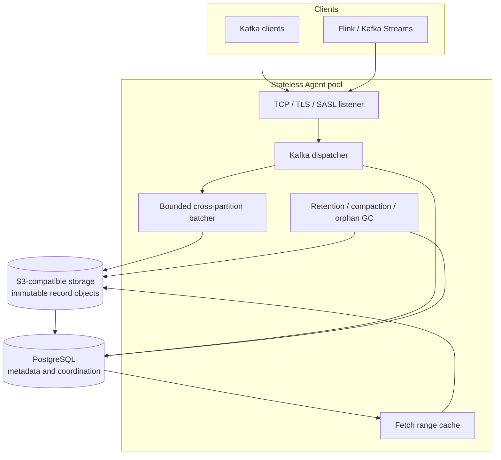

# Architecture and consistency model

rutomq is a Kafka-compatible message queue whose Agents do not own durable
partition data. PostgreSQL is the strongly consistent control plane and
S3-compatible object storage is the durable record plane.

## Components

All Agents expose the same logical cluster. There is no physical partition
leader, ISR, local replica log, local WAL, or Agent PVC. Kafka APIs that expose
those concepts are either mapped to one honest virtual broker or rejected when
the physical behavior cannot be represented truthfully.

## Produce commit protocol

1. The Agent validates the request, ACLs, producer sequence, transaction state,
   topic configuration, and record batches.
2. The bounded batcher combines blocks from multiple topic-partitions until its
   time, byte, or topic flush threshold is reached.
3. The Agent writes one uniquely named immutable object through OpenDAL.
4. A PostgreSQL transaction serializes the affected partitions, allocates
   contiguous offsets, validates producer state again, and commits object-span
   indexes plus visibility state.
5. Only after both durable operations succeed does the Agent acknowledge
   Produce.

This ordering deliberately permits one failure residue: an object can exist
without committed metadata. Such an object is never visible to Fetch and is
removed by orphan-object GC. The inverse state—committed metadata referencing
an object that was never written—is not an accepted Produce outcome.

## Fetch path

PostgreSQL stores ordered spans containing the topic ID, partition, object key,
byte range, base and last offsets, timestamp range, transaction state, format
version, and checksum. Fetch:

1. resolves the requested offset to ordered spans;
2. performs OpenDAL range reads, using a bounded Agent-local cache;
3. verifies the stored checksum and decodes the object block;
4. rewrites Kafka batch offsets and CRCs after filtering transaction visibility;
5. returns data within Kafka partition and request byte limits.

The cache is disposable protocol acceleration. Agent loss can discard it
without losing acknowledged records or committed offsets.

## Coordination state

PostgreSQL also persists:

- topic IDs, configurations, partition high watermarks, and log start offsets;
- idempotent producer IDs, epochs, sequence history, and transaction state;
- classic, consumer, share, and Streams group membership and assignments;
- committed and transactionally staged consumer offsets;
- SCRAM credentials, delegation tokens, ACLs, quotas, and client metrics;
- retention, compaction, object-deletion obligations, and maintenance leases.

Logical coordinators use PostgreSQL locks and epochs rather than Agent
ownership. A retry may reach another Agent and still observe the same fencing
and idempotency decisions.

## Retention and compaction

Objects may contain blocks for several topic-partitions. Retention therefore
removes logical span references before physical objects. An object is deleted
only after its final span is gone and the persisted deletion deadline has
elapsed. The durable deletion obligation remains in PostgreSQL until OpenDAL
confirms deletion.

Log compaction writes replacement immutable objects, preserves sparse Kafka
offsets, and swaps span references with a PostgreSQL compare-and-swap. It never
renumbers retained records.

## Failure semantics

| Failure | Observable result |
| --- | --- |
| Agent exits before acknowledgement | The client retries; uncommitted memory is discarded |
| Object PUT fails | No metadata is committed and Produce fails |
| Object PUT succeeds, PostgreSQL commit fails | Data remains invisible; orphan GC removes the object |
| Agent exits after durable commit but before response | Idempotent retry returns the original offset |
| PostgreSQL unavailable | Durable coordination stops; Produce is not acknowledged |
| Object storage unavailable | Record writes and uncached reads fail; Produce is not acknowledged |
| Cache loss | Fetch rereads verified ranges from object storage |

## Deliberate boundaries

rutomq depends on PostgreSQL and S3-compatible storage for durable progress. It
does not currently provide cross-region replication, a Schema Registry,
Kafka Connect management, a Kubernetes Operator, or multiple virtual clusters.
Non-empty online conversion between classic and Kafka consumer group protocols
also remains outside the `v0.1.0` compatibility envelope.

See the [compatibility matrix](compatibility.md) for the exact API contract.
